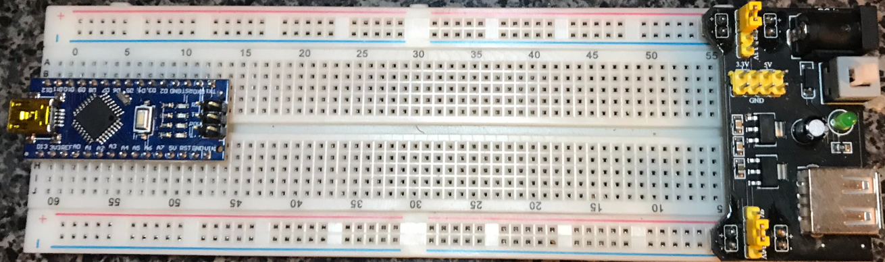
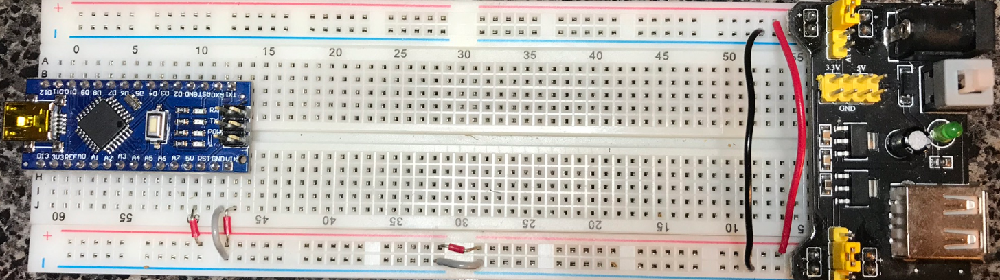
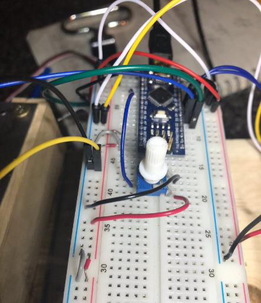
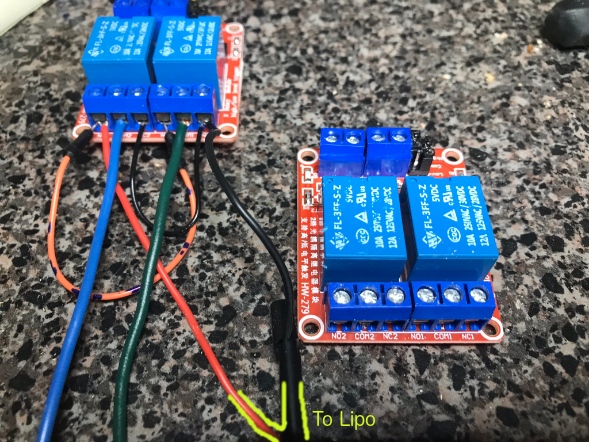
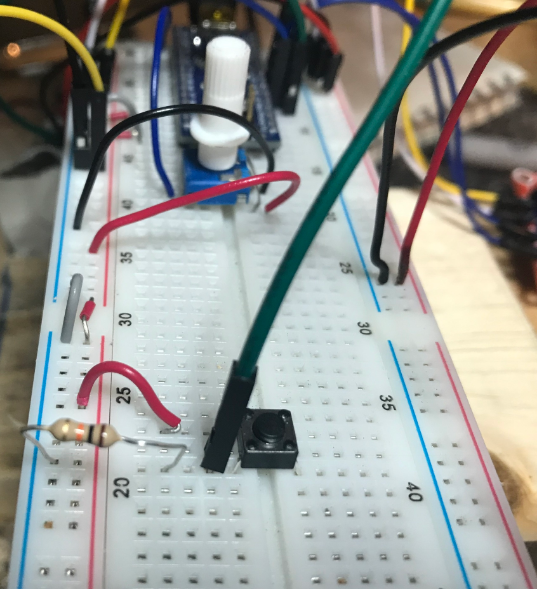

# Arduino Motion Sensing Automated Turret

This project docments my efforts to create a toy sentry. I have a Nerf Rival mounted on a homemade wooden turret which can be panned 180&deg;.

## Parts
* (A) Arduino Nano
* (B) MB102 power supply
* (C) SF3218MG servo which controls the turret panning
* (D) 60 pin breadboard
* (E) 1 Potentiometer to control where the gun points
* (F) 6V power supply (4xAA) with on/off switch
* (G) Relay which controls the nerft motors
* (H) Power Door Lock Actuator (amazon)
* (I) 12V power supply
* (J) SparkFun OpenPIR motion sensor (https://www.sparkfun.com/products/13968)
* (K) 4xAA battery case
* (L) Pushbutton

## Basic Setup

Linux Arduino Setup
You need to grant yourself permission to the usb device which will interface with the arduino nano:
```
sudo usermod -a -G dialout yourself
```
Verify you have added yourself to the ``dialout`` group by typing ``groups`` at the prompt. After adding yourself to the group you need to restart your session which probably means logging out, and back in again; on my system i had to reboot.  

I haven't documented the physical consturction of the turret; it's functional but nothing to write home about.

## System Assembly

### Primary Components
Place the arduino (A) and MB102 power supply (B) on the breadboard at opposite ends. This allows the device to be controlled by external power or, through the UNO’s USB for debugging.

**Figure 1: Microcontroller and external power module**


Connect power from the barrel side of the MB102 (B) to the other side of the breadboard.
Set the jumper on the MB102 (B) to 5V and set the jumper on the USB of the MB102 to Off.

Since the breadboard’s power stops at pins 30, place jumpers from the positive and negative rails of the broadband to send power to the other end of the breadboard.

Add a jumper wire from the arduino’s 5V out to the breadboard’s 5V line.
Add a jumper wire from the arduino’s grnd to the breadboard’s ground line.

To provide power to the arduino when using the MB102, add a jumper wire from the breadboard’s positive line to the arduino’s VIN.

**Figure 2: Wire the MB102 and Nano to power on the breadboard**


### Panning the Turret
To control the turret’s panning the microcontroller is connected to a SF3218MG (C) servo. For now i am just going to add a potentiometer to the breadboard for controlling the panning. Later this will be replaced by a camera which can follow objects and move the turret as needed.

The datasheet for the SF3218MG says it can operate with just 4.7V but i’ve found it needs at least 6V so I am using a 4xAA battery case (J) to provide its power. This power needs to be separated from the arduino’s power so i am going to use the one remaining section of the main breadboard (D).

Place the potentiometer (E) on the board and connect it to the breadboard’s (D) power rail and connect the POT’s center pin to A0.

The POT's power needs to be connected to the power bus that is connected to the arduino's power. If you connect the POT to the power bus which powers the servo you will get unexpected result; possibly a short.




Connect the 6V power supply (F) to the power rail.

Connect the servo's (C) power to the breadboard and the input line to the arduino’s (A) digital line ~3.

Also run a common ground from the right side of the board to the left side.  White wire.

**FIgure 4: Connect the panning servo**

Add the following code to the sketch which pans the turret using the POT (E).


### The Firing Motors

The nerft gun has two motors and when a ball gets put between them it is fired. There are two triggers on the gun; one starts up the motors and the other pushes the ball into the motors. I have removed the trigger which starts the motors and added a relay (G) that is enabled by the microcontroller. Power for the motors continues to be supplied by the 6 C batteries which are part of the gun.

Place a relay (G) in between the batteries and the motors. Connect the signal line of the relay to pin D4 on the microcontroller. Connect vcc and ground pins of the relay to the breadboard.

**Figure 5: Single relay to control motors**


The following code can be added to the sketch to test the motors. The actual code which enables the motors will be added once the motion sensor (PIR) is attached.


### Chambering and Firing
Firing this toy gun is accomplished by feeding soft yellow balls in to the rotating wheels controlled by the motors which were set up in the previous step. Normally this is accomplished by pulling a trigger whih slightly rotates a plastic latch which does two things:
A plastic divider comes down, separating the ball to be fired from the rest of the balls in the clip. This way only one ball is fired at a time.
The ball which is to be fired is pushed forwarward into the rotating wheels.

I have removed the trigger and to the latech which the trigger controlled I attached a power door lock actuator (H). This linear actuator requires 12V which are delivered via a 1500mAh 120C 11.V LiPo battery (I)

**Figure 6: Power door lock actuator**


The linear actuator receives power from a blue wire and a green.  When the blue wire receives 12V+ and the green wire is connected to ground the actuator extends. When the wires are reversed the actuator retracts.

I am using a dual channel relay module (J) to provide power to the actuator. The polarity of the power is controlled by two input pins connected to the microcontroller.
Wiring the two channel relay
The dual channel relay module (J) is connected to a single 12V power supply and depending on the inputs (high/low vs low/high vs low/low or high/high) it will can reverse the positive/negative signal.  

Warning && Danger |
-------------------
The wiring of the dual channel relay module to the LiPo power supply is the most sensitive part of this project. If any leads are connected wrong or the leads to the battery are connected to the arduino instead of to the actuator a short will occur you will either blow up the LiPo battery (which is super dangerous, destroy the relay, or destroy the actuator. |

Before wiring this up for real you should connect it to a lower volt battery and use the sample code to test your setup. See sketch “TwoChannelRelayTest0”


The wiring is a little complicated and instead of explaining it will just show what i have done, and provide a link to someone else who explains it.

Example: https://microlinearactuator.com/control-micro-linear-actuator-using-relays-microcontrollers/#prettyPhoto/0/

**Figure 7: Wiring of the external power supply side for the dual channel relay module**


**Figure 8: Wiring of the microcontroller side for the dual channel relay module**


Dual channel relay wiring:
* Battery side
  * NO2
    * to NO1 (orange stripe)
    * to battery positive (red)
  * COM2
    * to actuator positive (orange)
  * NC2
    * to NC1 (short black)
  * NO1
    * to NO2 (orange stripe)
  * COM1
    * to actuator negative (white)
  * NC1
    * to NC2 (short black)
    * to battery negative (long black)
* Microcontroller side
  * Jumper s1: LOW-COM
  * Jumper s2: COM-HIGH
  * DC+
    * microcontroller positive
  * DC-
    * microcontroller negative
  * IN1
    * microcontroller digital pin 6
  * IN2
    * microcontroller digital pin 7


To connect the relay and the battery to the toy gun I used an XT60-to-barrel connector to a thingee and then wired the thinggee to the power door lock actuator (H).

#### Manual Fire

Add a pushbutton to the breadboard so you can manually fire the gun. This is particularly useful for testing.

Place the pushbutton the breadboard.
Connect one side of the button to power with a jumper wire.
Connect the other side of the button to ground with a 10Kohm resistor.
Run a jumper wire from the ground side of the button to arduino pin D10.

Add the initialisation code for ``MANUAL_FIRE_BUTTON_IN``, and the ``isManualFireButtonPressed()`` function to the sketch.

**Figure 9: Wiring of the external manual fire button**



Connect the relay to the toy gun


### Motion Sensor

To detect motion and trigger firing the gun I am using the Sparkfun OpenPIR (J)  which has analog and digital input.  This module allows you to control the sensitivity of the motion sensor and the length of time that the digital out signal remains high when motion is detected. By adjusting duration of the digital out you could make the gun fire more than once each time motion is detected, but i plan to keep this setting low so only one shot is fired each time motion is detected.

Connect the analog out, “A”, output to the microcontroller’s A2.
Connect the digital out, “OUT”, output to the microcontroller’s D12
Connect the PIR’s “VCC” and “GND”  to the power rails on the breadboard.
I have connected the PIR’s power so that it shares the same power as the microcontroller.

To test the PIR load the testing sketch sparkFunOpenPIR_Test0 and open your Serial Monitor.
The sample code uses 115200 baud for communication so be sure to set that in the Serial Monitor.

Add the following constant definitions to your code:
const int PIR_ANALOG_PIN_IN A3;   // PIR analog output on A3
const int PIR_DIGITAL_PIN_IN 12;  // PIR digital output on D12

Add the motionDetected() function.


## Addendum

### Arduino Pin Chart

| Pin | Mode | Function                                                     |
| --- | ---- | ------------------------------------------------------------ |
| D3  | Out  | Control turret pan servo                                     |
| D4  | Out  | Control the relay which provides power to the firing motors. |
| D10 | In   | Manually fire the gun                                        |
|     |      |                                                              |

### Firing Tests


* Test 0: Load 10 balls and manually fire 10 times.
  - ACTUATOR_RESPONSE_DELAY = 250;
  - FIRING_MOTOR_WARMUP_DELAY=1000;
  - Success rate: 10/10


### Troubleshooting

**The firing motors aren't turrning on**
Make sure the sliding access door used for clearing jamed balls is closed. You need to push the door shut until it clicks.

If you have a light on the single relay which controls the motors then make sure that light is on and the realy is receiving power.

Check the 6C batteries.

### Next Steps

- [ ] Add an ammo counter so the gun doesn't fire when it is empty
- [ ] Mount the motion sensor
- [ ] Adjust PIR sensitivity
- [ ] Reduce the amount of time for the FIRING_MOTOR_WARMUP_DELAY
- [ ] Reduce the amount of time for the ACTUATOR_RESPONSE_DELAY
- [ ] Fill in the rest of the " Arduino Pin Chart"
- [ ] Disconnect the microcontroller's usb and use the power supply.
- [ ] Use an OpenMV camera to find the target
      - should the PIR still be used in order to save power?
- [ ] Document construction of the turret frame
- [ ] Move everything off the breadboard and wire up a permanent solution
- [ ] Complete documentation and images
